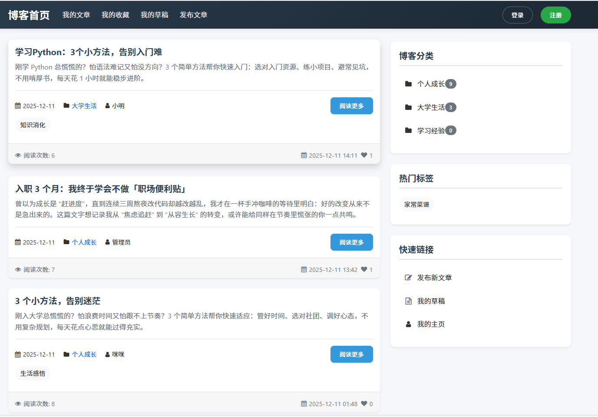
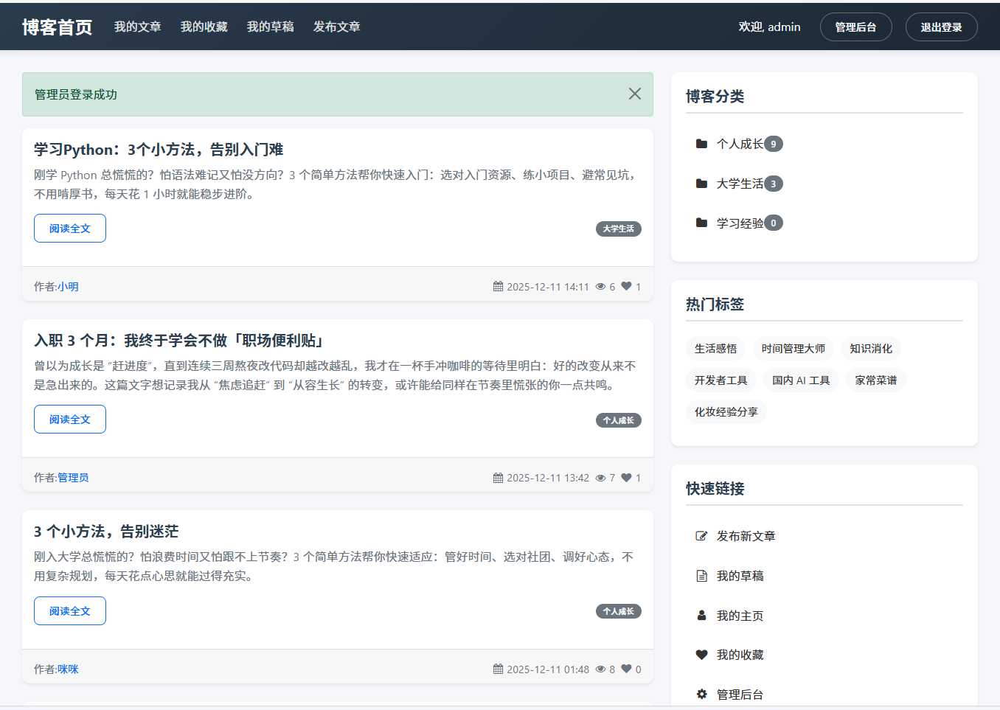
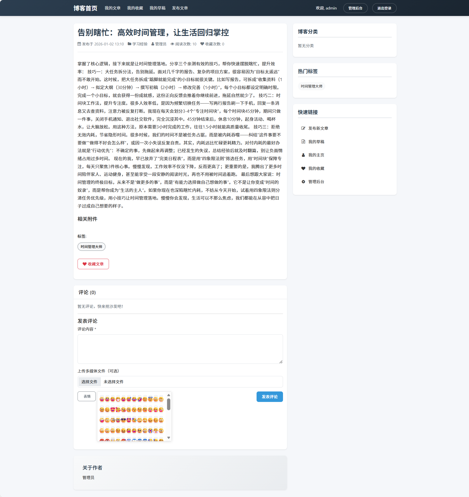
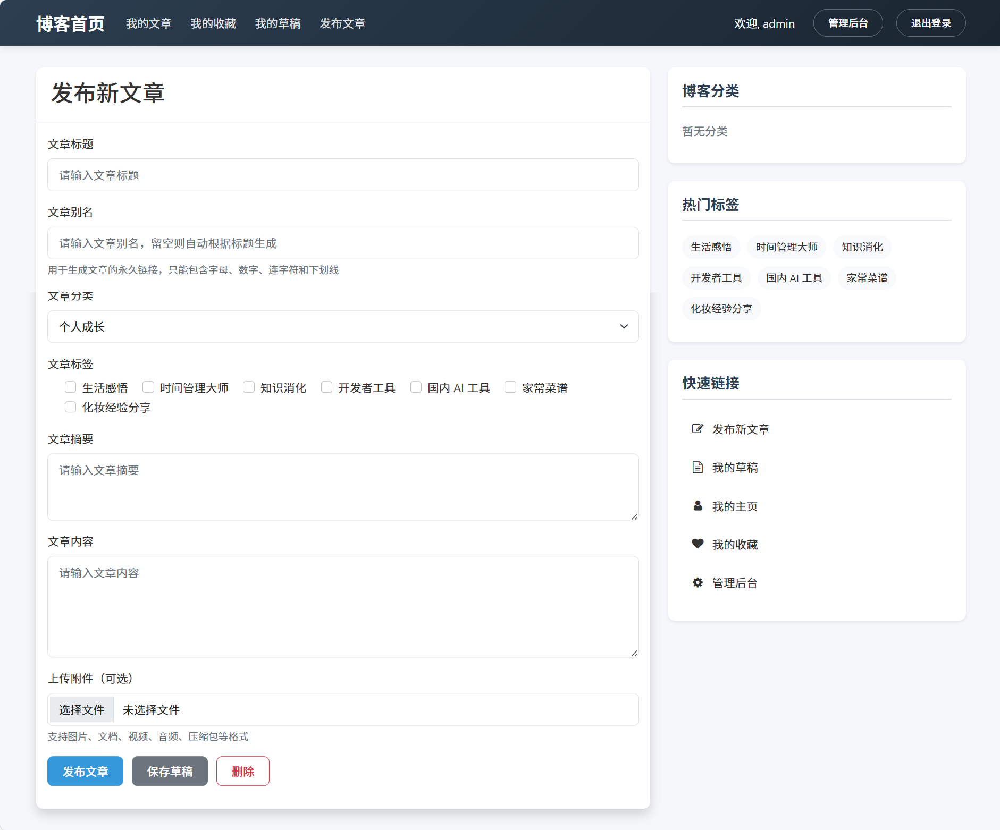
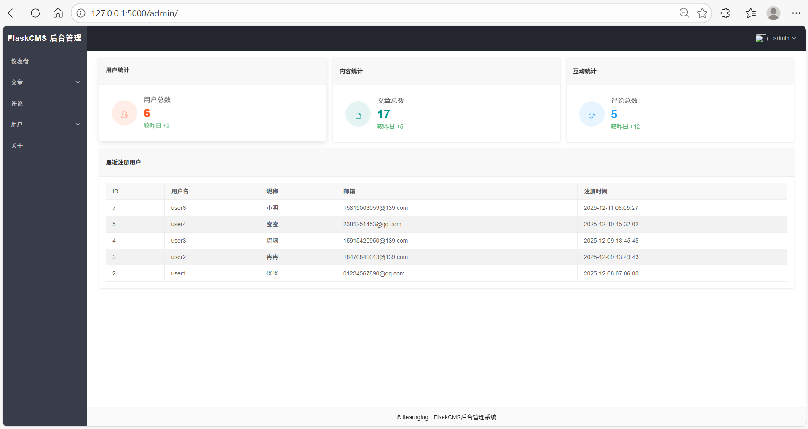
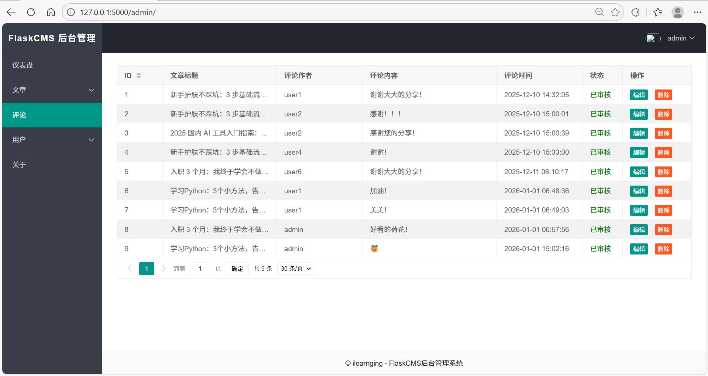

# 博客系统

### 软件架构
B/S 架构

## 系统特性

### 技术架构
- **Flask 框架**：基于轻量级 Python Web 框架构建
- **SQLAlchemy ORM**：使用 ORM 进行数据库操作
- **WTForms**：表单处理和验证
- **Flask-Login**：用户会话管理
- **SQLite 数据库**：默认使用 SQLite 作为数据存储

### 前端技术
- **响应式设计**：适配不同屏幕尺寸的设备
- **Bootstrap**：使用 Bootstrap 框架实现现代化界面
- **Jinja2 模板**：服务端模板渲染
- **FontAwesome**：图标字体库，提供丰富的图标

### 安全特性
- **密码加密**：使用安全哈希算法存储用户密码
- **会话管理**：通过 Flask-Login 管理用户会话
- **CSRF 保护**：表单中集成 CSRF 保护机制
- **输入验证**：严格的表单输入验证

## 项目展示
_未登录状态的首页_

_admin登录状态下的首页_

_一篇已登录状态下的博客_

_新建博客文章_

_管理员admin的后台管理_ ，所有用户的密码都为12345678

_后台评论管理_

## 使用说明

默认使用前后端分离模式，启动程序命令如下：

```bat 
# 第一次运行
pip install requirements.txt
set FLASK_APP=manage.py
set FLASK_DEBUG=True
flask run
```
```bat 
# 第二次运行
# 1. 设置 FLASK_APP，指定 create_app 传入 "development" 配置（适配项目的开发环境）
$env:FLASK_APP = "app:create_app('development')"
# 2. 开启调试模式（可选，开发环境建议开启）
$env:FLASK_DEBUG = "1"
# 3. 启动应用
flask run
```